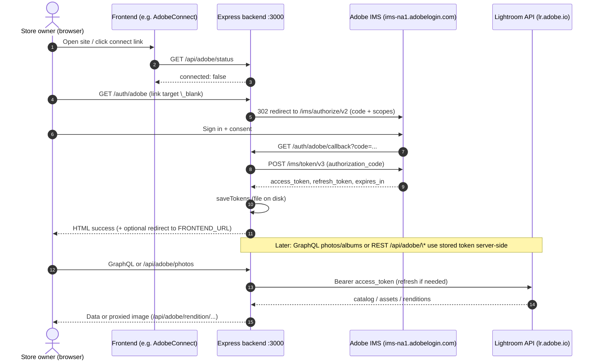
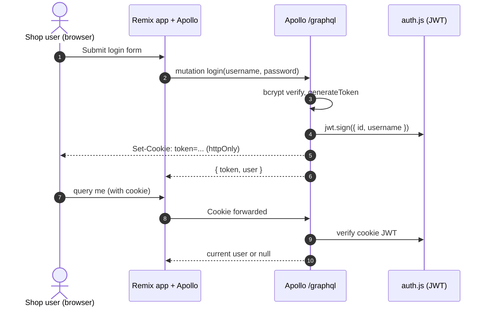

# Lightroom Photo Store

A modern photo store application built with React Router 7, React 19 Server Components, and GraphQL with Apollo Server.
Connects with the Adobe Lightroom APIs for Oauth, catalogs, assets and renditions.

## Install & run

```bash
# from repo root
npm install

cd backend
npm install
npm run dev      # start GraphQL API (port 3000 by default)

# in another terminal, from repo root
npm run dev      # start React Router frontend (Vite, port 5173 by default)
```

The frontend talks to the backend’s `/graphql` endpoint. If you change ports or enable HTTPS, point the frontend at the correct URL via environment variables (see `backend/README.md` for details).

### To sign in via Oauth to Adobe Lightroom

- Make sure you're utilizing Https
- navigate to the backend servers `/auth/adobe` endpoint.
  (This should redirect you to adobe for the Oauth.)
- Once you've logged in on the Adobe site, the temporary auth code must be added as a query param to the `/auth/adobe/callback?code=<your code>` route like so.

## Project structure (high level)

```text
app/        React Router app (routes, components, Apollo client, Tailwind)
backend/    GraphQL API (Apollo Server + Express, auth, Adobe integration)
```

1. Adobe Lightroom OAuth (owner setup)



2. Shop user flow



## More docs

For API schema, HTTPS configuration, and Adobe Lightroom setup (OAuth and tokens), see the docs in the `backend` folder, especially `backend/README.md` and `backend/README_ADOBE.md`.
